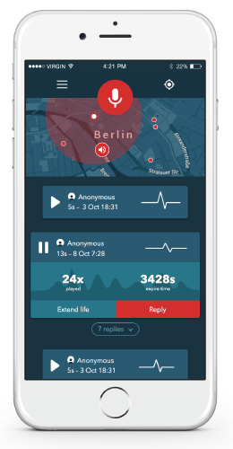

# [schnauze.io](https://schnauze.io)

Schnauze is an iOS app build with Meteor. You can record and share geo-localised audio snippets and listen to others that are close to your location. Audio messages have a limited life but if you like them you can extend their presence on the map.

## Created for the [Meteor hackaton 2015](http://meteor-2015.devpost.com/)

- **Start: Sunday, October 10, 2015 (GMT+2), 11:00 AM**
- **End: Sunday, October 11, 2015 (GMT+2), 11:00 AM**

### 1. Video 1:30
[Watch the video](http://vimeo.com)

### 2. Packages used in the project

- meteor-base
- mobile-experience
- mongo
- blaze-html-templates
- session
- jquery
- tracker
- standard-minifiers
- coffeescript
- fourseven:scss
- cfs:standard-packages
- cfs:gridfs
- dburles:google-maps
- reactive-var
- nooitaf:colors
- infinitedg:gsap
- mrt:q
- raix:eventemitter
- momentjs:moment
- flyandi:reactive-countdown
- u2622:persistent-session

### 3. This repo

**Done with love from Berlin @ [Arillo](http://arillo.net)**
