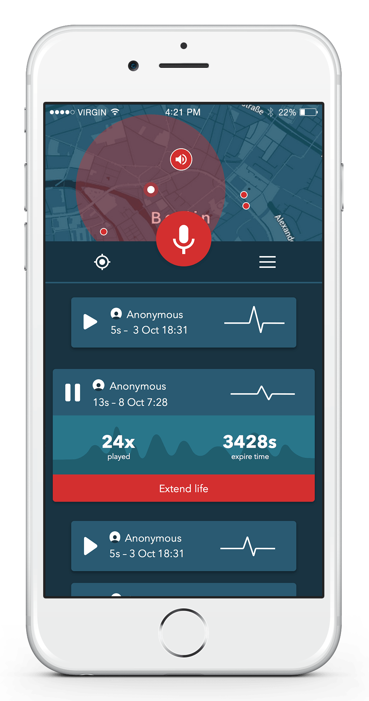

# [schnauze.io](https://schnauze.io)

Record, share and listen to geo-localised audio messages. Find new stories and give more lifetime to the one you love!

#### Record audio messages

With Schnauze you can record geo-localised audio snippets. Simply press and hold the record button and start speaking to place and share your message on the map!

#### Listen to messages around you

You can listen to all the audio files that are close enough to your location. Simply tap on them in the map or navigate through them in the list view.

#### Extend life of a snippet

If you like what you are listening you can extend the life of an audio message in the map. Tap on ‘Extend life’ to give more time to that audio snippet.

## Created for the [Meteor hackaton 2015](http://meteor-2015.devpost.com/)

- **Start: Saturday, October 10, 2015 (GMT+2), 11:00 AM**
- **End: Sunday, October 11, 2015 (GMT+2), 11:00 AM**

### 1. Video 1:30
[Watch the video](https://vimeo.com/142040946)

### 2. Packages used in the project

- meteor-base
- mobile-experience
- mongo
- blaze-html-templates
- session
- jquery
- tracker
- standard-minifiers
- coffeescript
- fourseven:scss
- cfs:standard-packages
- cfs:gridfs
- dburles:google-maps
- reactive-var
- nooitaf:colors
- infinitedg:gsap
- mrt:q
- raix:eventemitter
- momentjs:moment
- u2622:persistent-session
- d3js:d3

### 3. This repo

The app currently only is targeting iOS. We are planning to add android support in the future. To test the app in an iOS simulator, just run:

    ./xrunner ios

If you want to get a TestFlight invitation just e-mail us at we(at)arillo.net

### Future development

- Allow to reply audio snippets
- Autoplay by walking through the city

**Done with love from Berlin @ [Arillo](http://arillo.net)**
